# mh_doc_verify — Project Architecture & Flow Diagrams

This document is the single source of truth for understanding the **Doctor Document Verification Portal** — one module inside the larger RBAC system for the **Mental Space** platform. The portal is used exclusively by internal staff (assigned by the platform admin) to review, approve, or reject doctor applications. Doctors submit their applications and documents on a separate platform; this portal pulls that data and presents it for review.

All diagrams use Mermaid flowchart syntax. The focus is on **how data and control flow through the system**.

---

## 1. Folder & File Structure

The project has two layers — the Django **project config** (`app_doc_verify/`) which holds settings, main URL router, and the login view, and the **business logic app** (`doc_review/`) which holds all models, views, URLs, email stub, admin registration, and the seed command. Templates, static files, and the simulated GCP media folder live at the project root level alongside both packages.

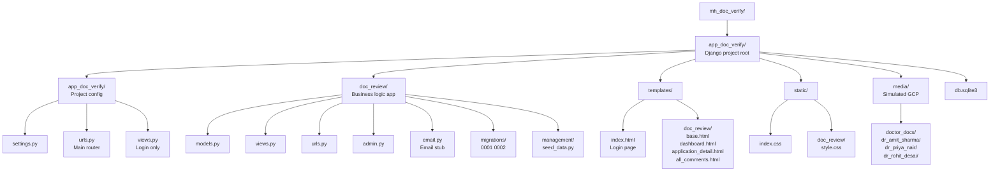

---

## 2. Database Schema & Relationships

The system has two custom tables — `DoctorApplication` and `Comment`. Both link to Django's built-in `User` table. Staff accounts are created only by the superuser through the `/admin/` panel — no signup flow exists in this portal. `reviewed_by` on `DoctorApplication` uses `SET NULL` so that deleting a staff account never deletes the application record — it just clears the reviewer reference. `Comment` uses `CASCADE` so comments are cleaned up if either the application or the author is deleted.

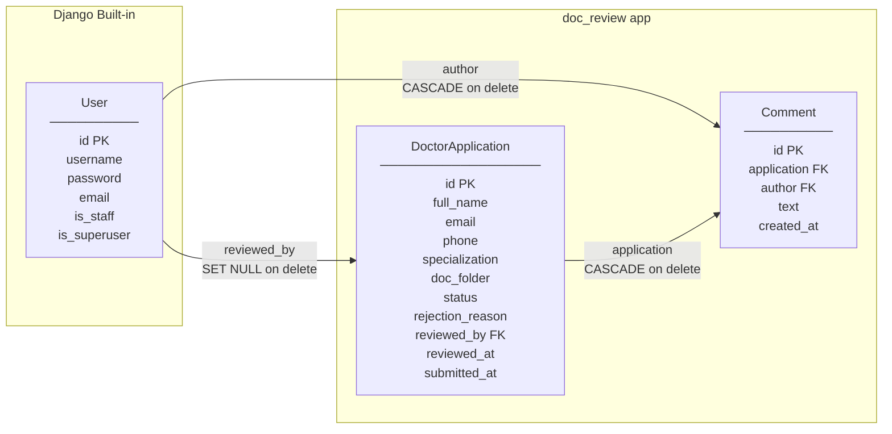

**Field notes:**
- `doc_folder` stores a relative path today (`doctor_docs/dr_amit_sharma`) — when GCP is connected this becomes a bucket path, no model migration needed
- `rejection_reason` is always stored as an empty string if approved — no null needed
- `Comment` is a separate table so multiple staff can add multiple notes over time as a thread

---

## 3. URL Routing Map

Every HTTP request hits `app_doc_verify/urls.py` first. That file either handles it directly (login, admin, media files) or delegates to `doc_review/urls.py` via `include()`. This two-level routing keeps the project config clean and the app self-contained. The `include()` at the empty path `""` means `doc_review` URLs are at the root — so `/dashboard/` not `/doc-review/dashboard/`.

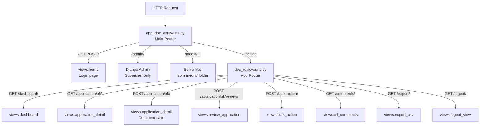

---

## 4. Authentication & Login Flow

The login page at `/` is the only public URL. Every other view is protected by `@login_required`. If an unauthenticated user visits `/dashboard/` directly, Django redirects them to `/` automatically because `LOGIN_URL = '/'` is set in `settings.py`. The `authenticate()` function hashes the submitted password and compares it to the stored hash — plain text passwords are never stored. On success `login()` writes a session record to the database and sets a `sessionid` cookie in the browser — all subsequent requests carry this cookie and Django validates it automatically.

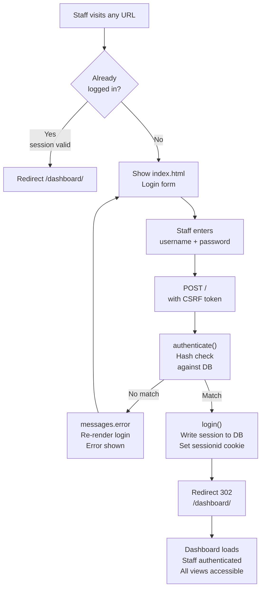

---

## 5. Dashboard — Filter, Search, Pagination & Dot Logic

The dashboard is the main working screen. Staff can filter by status, search by name or email, and page through results 20 at a time. All three parameters (`status`, `q`, `page`) work together — changing the filter resets to page 1 while keeping the search, and the CSV export button carries the same params so the download always matches what is on screen. The yellow dot is computed with a single `DISTINCT` query that returns a Python set — the template then does an `O(1)` set lookup per row with no extra DB queries.

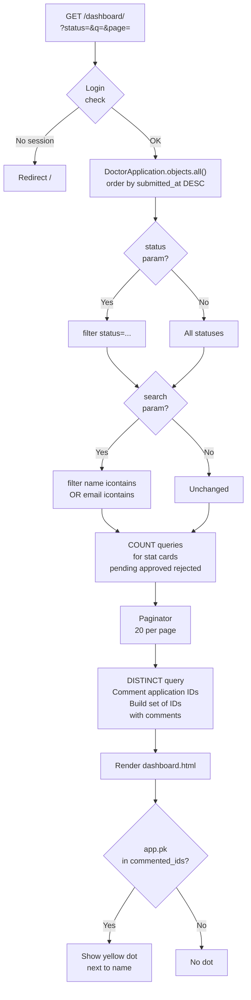

---

## 6. Application Detail & Comment Flow

The detail page shows everything about one doctor — their info, all submitted documents as clickable links that open in the browser, and the full internal comment thread. The same URL `/application/pk/` handles both GET and POST. On POST it saves the comment and immediately redirects back to GET — this is the PRG pattern (Post-Redirect-Get) which prevents the browser from re-submitting the comment if the staff member refreshes the page. Documents are served from the `media/` folder in development — each file link opens in a new browser tab.

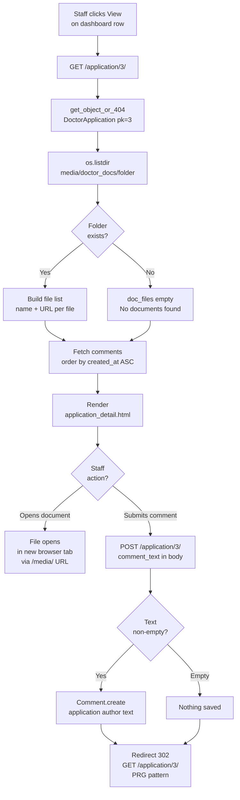

---

## 7. Approve & Reject Decision Flow

The review endpoint `/application/pk/review/` only accepts POST. A direct GET visit redirects back to the detail page. Rejection requires a non-empty reason — submitting without one redirects back with an error and nothing is saved. After every successful decision `send_decision_email()` is called immediately — today it prints to the console, in production it will send a real email to the doctor without any other code changes.

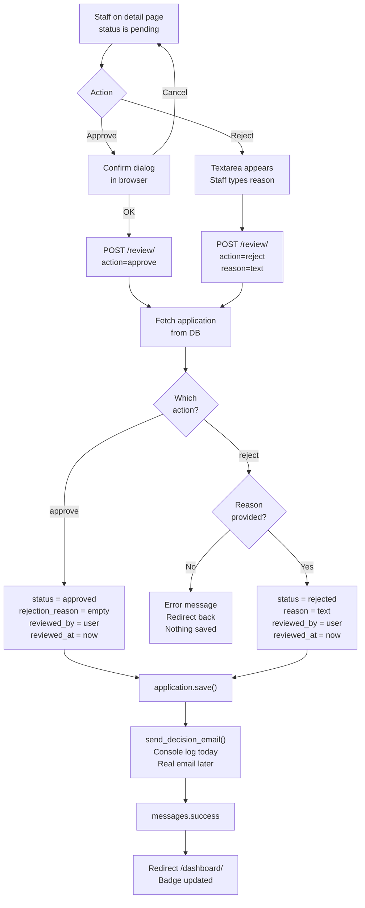

---

## 8. Bulk Action Flow

Bulk actions let staff process multiple pending applications in one submission. The checkboxes and toolbar are driven by JavaScript — the toolbar only appears when at least one checkbox is ticked, and shows the count of selected items. Only applications with `status=pending` are processed even if non-pending IDs are submitted — this prevents accidentally overwriting already-decided records. Each application in the loop gets its own email stub call so every doctor gets an individual notification.

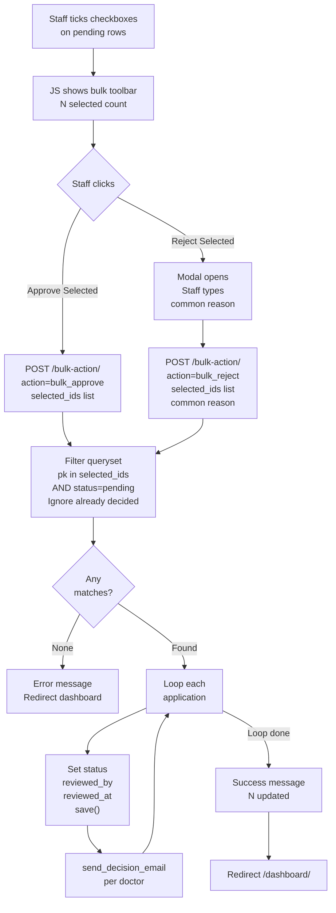

---

## 9. Email Stub Flow

The email module `email.py` is structured so that wiring real email in the future requires changing only the two private functions `_send_approval_email` and `_send_rejection_email`. The public function `send_decision_email` is called from `review_application` and `bulk_action` — those callers never change. Today both private functions write to the Django logger and print a formatted message to the runserver console. The `logger.info` calls are useful because they appear in log files even in production-like environments, while `print` is convenient during development.

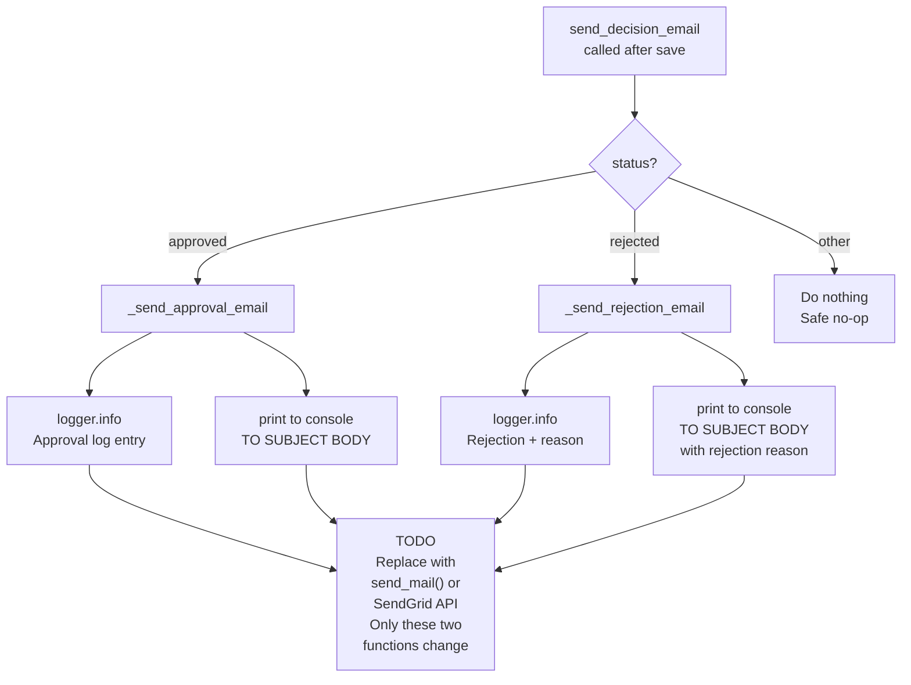

---

## 10. All Comments View Flow

The All Comments page gives staff a bird's-eye view of every internal note made across all applications in one table, sorted newest first. It uses `select_related('application', 'author')` so Django fetches all related data in a single SQL JOIN — no extra query per row. Staff can jump directly to any application from this view using the View button on each row.

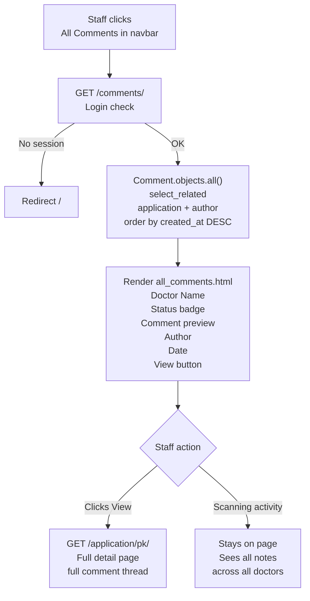

---

## 11. Yellow Comment Dot Logic

The yellow dot signals that an application has at least one internal comment — without opening it. It is computed with a single efficient query returning only IDs, converted to a Python `set` for O(1) lookup, then passed into the template context. The template does `app.pk in commented_ids` per row — no extra DB queries per row, no N+1 problem.

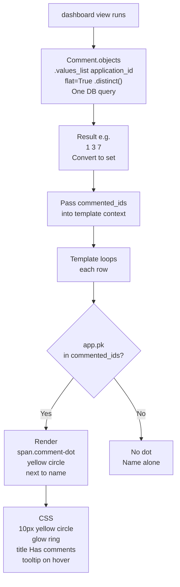

---

## 12. Export CSV Flow

The Export CSV button passes the current `?status=` and `?q=` params into the export URL so the download always matches exactly what is visible on the dashboard. The response uses `content_type=text/csv` and a `Content-Disposition: attachment` header so the browser treats it as a file download rather than a page render. The CSV includes all fields needed for reporting — ID, doctor info, status, rejection reason, reviewer, timestamps.

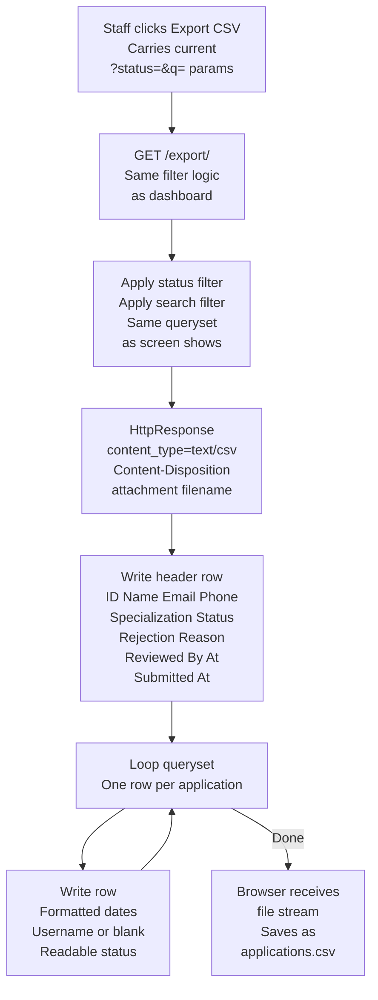

---

## 13. Complete System Flow — Admin to Final Decision

This is the end-to-end picture of the entire portal. The platform admin controls all access — they create staff accounts via the Django admin panel and share credentials. The staff member logs in, reviews doctor applications, leaves internal comments if needed, and makes the final approve or reject decision. The decision is written to the database with a full record of who decided and when — this is the audit trail the RBAC system relies on.

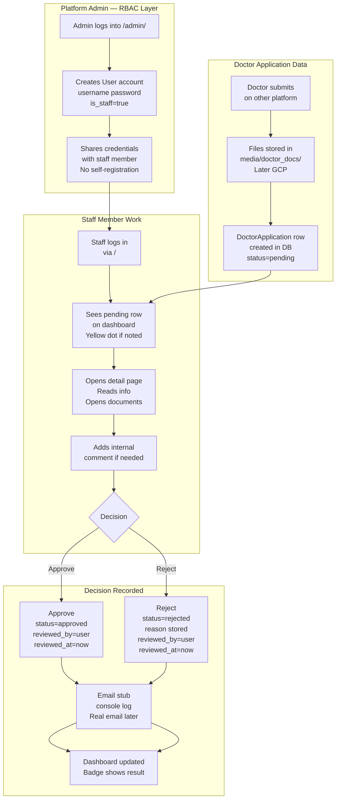

---

## 14. Future Integration — What Changes and What Does Not

The code is structured so each of the four major future upgrades requires a change in exactly one place. The rest of the codebase stays untouched.

- **SQLite → PostgreSQL**: change two lines in `settings.py` under `DATABASES`
- **Local folder → GCP**: replace the `os.listdir` block in `application_detail` view with GCP Storage client calls
- **Email stub → Real email**: fill in the two private functions in `email.py`
- **Seed data → Live pull**: replace the seed command with a job that reads from the main Mental Space platform DB or API

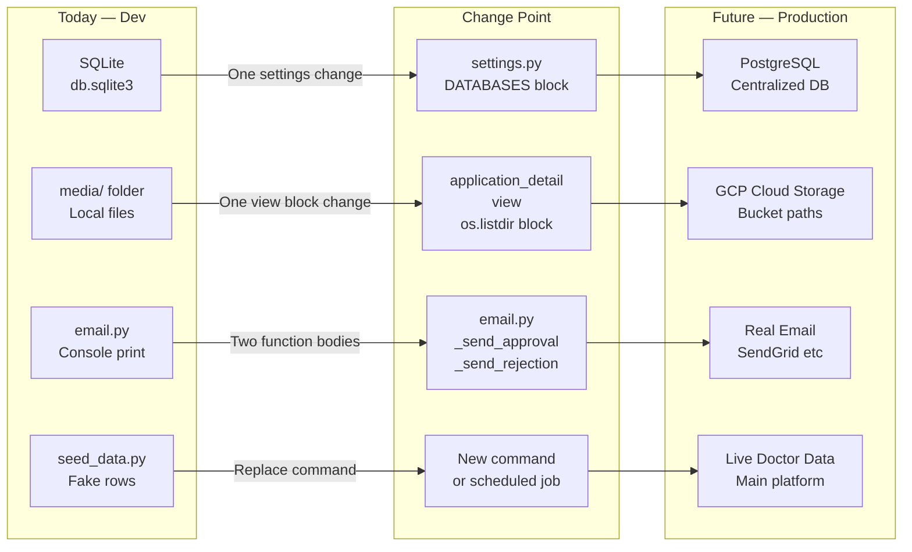

---

## URL Summary Table

| URL | Method | View | Login | What Happens |
|---|---|---|---|---|
| `/` | GET | `home` | No | Shows login form |
| `/` | POST | `home` | No | Authenticates, sets session, redirects to dashboard |
| `/dashboard/` | GET | `dashboard` | Yes | Application list with filter, search, pagination, stat cards, yellow dots |
| `/application/<pk>/` | GET | `application_detail` | Yes | Doctor info, document links, comment thread, approve/reject buttons |
| `/application/<pk>/` | POST | `application_detail` | Yes | Saves new comment, PRG redirect back to GET |
| `/application/<pk>/review/` | POST | `review_application` | Yes | Saves decision, triggers email stub, redirects to dashboard |
| `/bulk-action/` | POST | `bulk_action` | Yes | Processes multiple pending applications, email stub per doctor |
| `/comments/` | GET | `all_comments` | Yes | All comments across all applications newest first |
| `/export/` | GET | `export_csv` | Yes | Streams CSV download matching current filter |
| `/logout/` | GET | `logout_view` | Yes | Clears session, redirects to login |
| `/admin/` | GET/POST | Django Admin | Superuser | Create staff users, inspect all DB records |
| `/media/<path>` | GET | Django static | No | Serves doctor documents from media/ folder |
